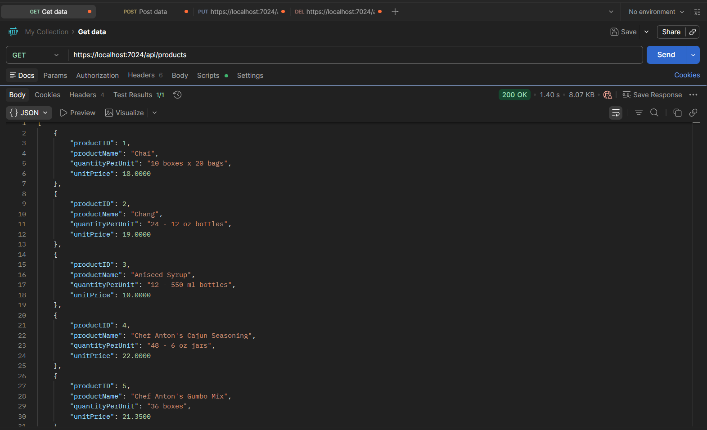
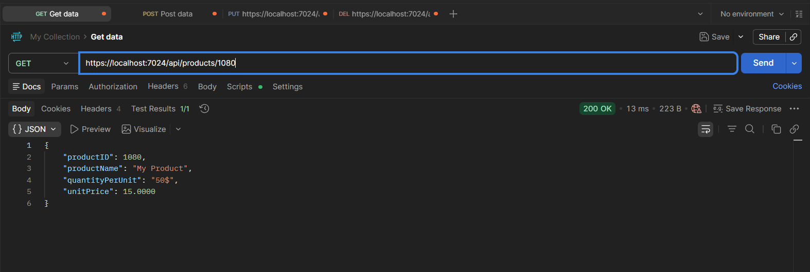
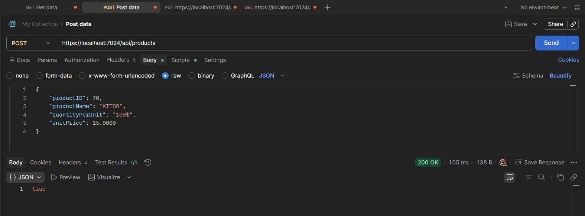
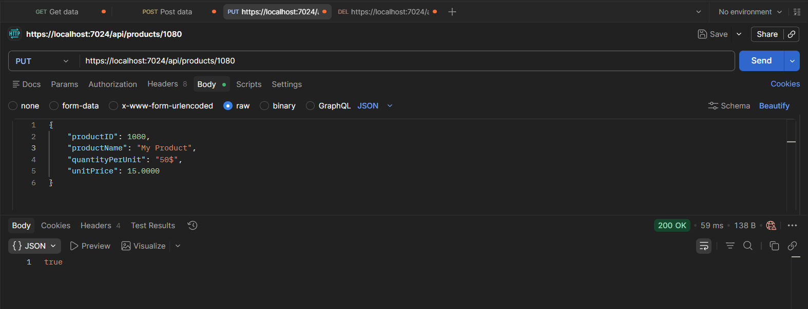
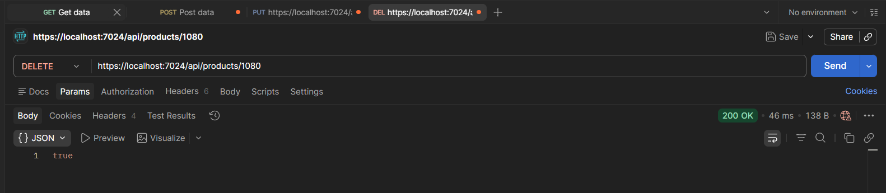

# MyFirstApi 
Bu C# tilida yozilgan Api loyihasidir

## Texnologiyalar:
* .NET 9
* ASP.NET Core
* Dapper
* SQL Server
---
## Requestlar va Api dan kelgan Response larning Postmanda ko'rinishi👇:
**Product modeli uchun Response and Request:**

*GetAll:*

*GetByID:*

*Create:*

*Update:*

*Delete:*

---

**Employee modeli uchun Response and Request lar ham xuddi shu kabi ishlaydi**